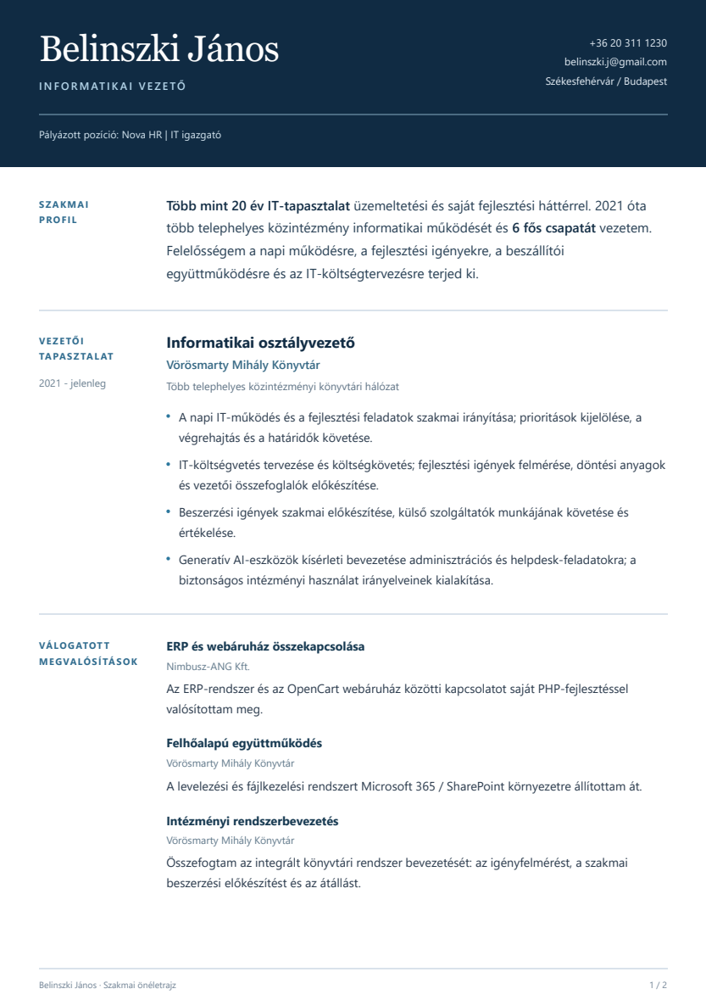
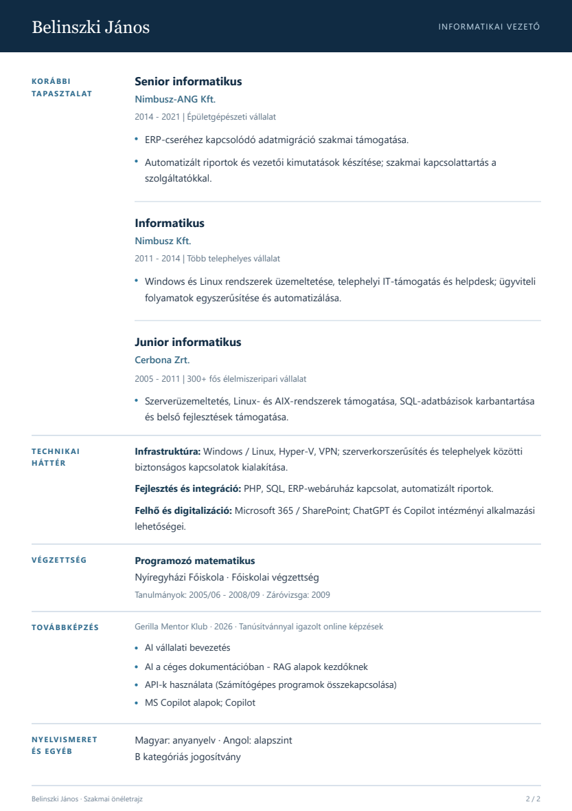
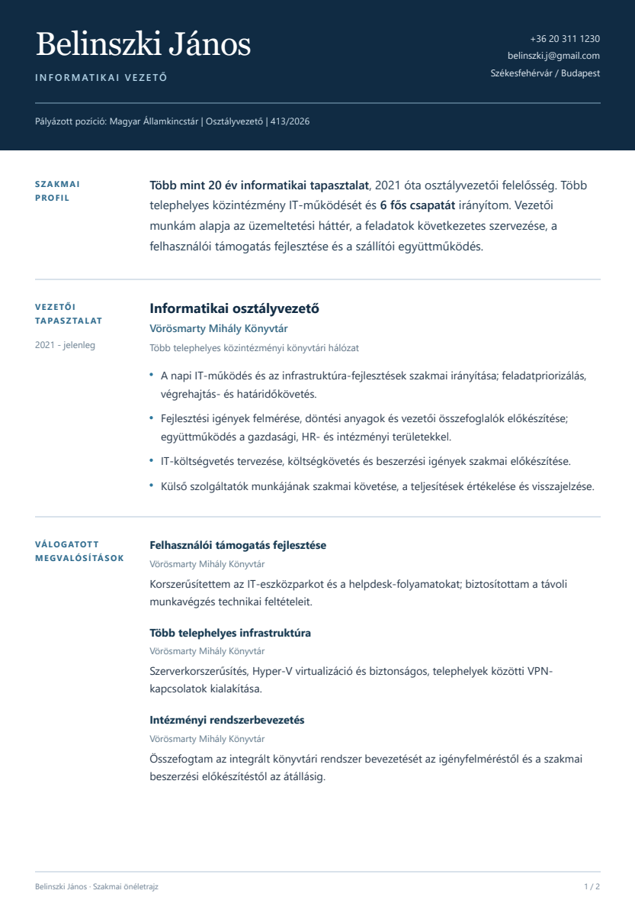
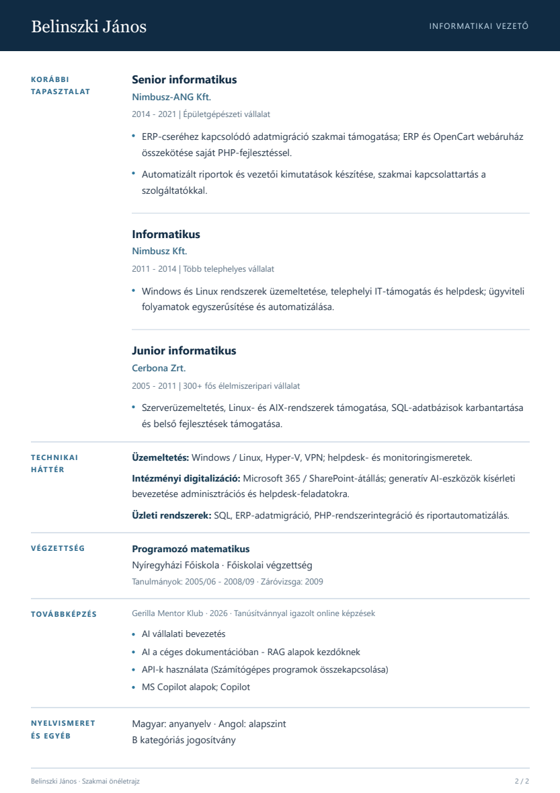

# Célzott vezetői önéletrajzok - v21

Készült: 2026. október 1. A Nova IT-igazgatói és a Magyar Államkincstár osztályvezetői pályázatához. A felhasználó visszajelzése alapján újraszerkesztett változatok; végleges felhasználói elfogadás még nincs.

| Pályázat | Jelentkezési PDF | Szerkeszthető HTML |
|---|---|---|
| Nova HR - IT igazgató | [v21 PDF](../../output/pdf/Belinszki_Janos_CV_Nova_IT_igazgato_v21.pdf) | [v21 HTML](Belinszki_Janos_CV_Nova_IT_igazgato_v21.html) |
| Magyar Államkincstár - Osztályvezető, 413/2026 | [v21 PDF](../../output/pdf/Belinszki_Janos_CV_MAK_Osztalyvezeto_413_2026_v21.pdf) | [v21 HTML](Belinszki_Janos_CV_MAK_Osztalyvezeto_413_2026_v21.html) |

## Szerkesztési alap

A [Hays önéletrajzi útmutatója](https://www.hays.hu/blog/insights/tippek-es-trukkok-a-tokeletes-oneletrajz-megirasahoz) alapján a bevezető, a releváns tapasztalat és az eredmények a konkrét pozícióhoz igazodnak; a szakmai pálya fordított időrendű. A [Harvard karrierközpont útmutatója](https://careerservices.fas.harvard.edu/resources/create-a-strong-resume/) a tényszerű, konkrét megfogalmazást, az olvashatóságot és a következetes formázást támasztja alá. Az útmutatók ellenőrizve: 2026. október 1.

Ezek szakmai szerkesztési támpontok, nem a dokumentumok független HR-minősítései vagy interjúgaranciái. Az egyedi vizuális megoldás: sötétkék fejléc, következetes betűhierarchia, keskeny szakaszcím-oszlop és széles szövegoszlop. A v20 készségcímkéit, nagy számlálóit és projektkártyáit egységes tipográfia váltja fel.

## Tartalmi változtatások

- Rövidebb vezetői profil, a tényleges felelősségi körrel; megmarad a 20+ év és a 6 fős csapat bizonyítható adata.
- Munkakör, felelősség és konkrét megvalósítás elkülönítve; a projektek mellett szerepel az érintett munkáltató.
- Nova: saját PHP/ERP–OpenCart integráció, felhőátállás és rendszerbevezetés.
- Kincstár: felhasználói támogatás, több telephelyes infrastruktúra és intézményi rendszerbevezetés.
- A korábbi munkahelyek tömörebbek; a diploma és mind az öt képzés megmaradt. Az angol alapszintű, kitalált megtakarítás vagy szakmai minősítés nincs.

## Folytatás és verziók

Minden érdemi eredmény, szerkeszthető forrás és szükséges folytatási információ a GitHub-repóba kerül. A v18-v20 fájlok változatlanok. A v21 későbbi módosítása új, v22-es fájlokba készüljön. A tartalom forrásai: [profilindex](../../profile/INDEX.md). Az előállításhoz a `scripts/build-cv-v21.py` és `scripts/render-cv-v21.cjs` tartozik; a PDF-ek és HTML-ek közvetlenül is használhatók. Böngészős PDF-exporthoz Playwright és Chromium/Edge szükséges; a futtató környezet útvonalai felülírhatók a renderelőben jelzett környezeti változókkal.

Megnyitható előzmények: [v19-v21 PDF-ek](../../output/pdf/) és [HTML-változatok](./). A következő visszajelzésnél az adott verzió és oldal azonosítható; nem kell újra feltölteni a szakmai dokumentumokat.

## Előnézetek

Nova - mindkét oldal

Magyar Államkincstár - mindkét oldal

