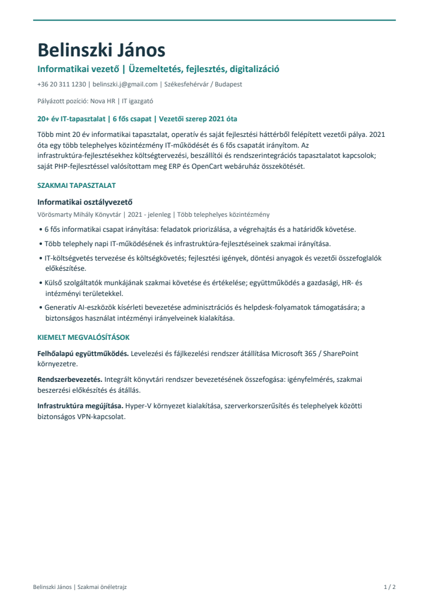
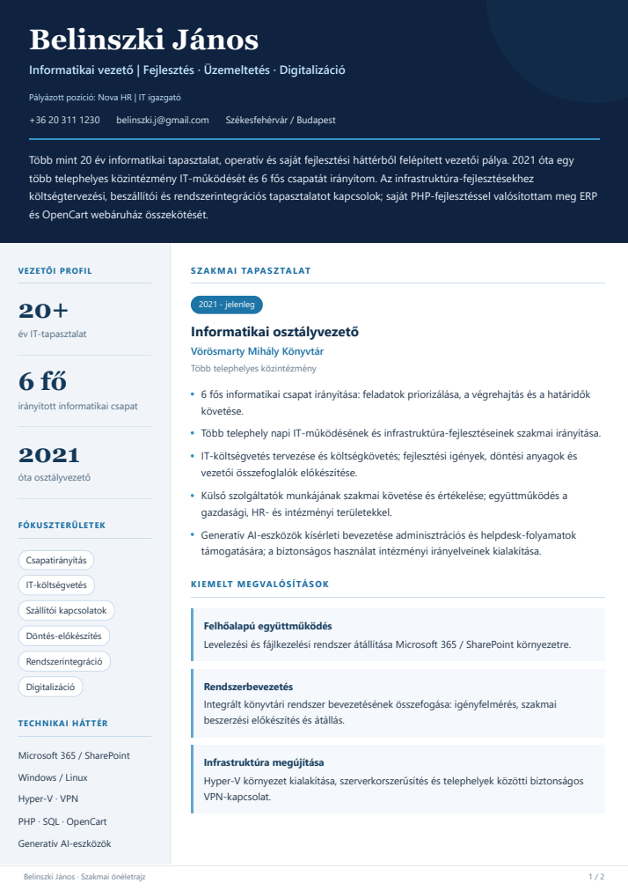
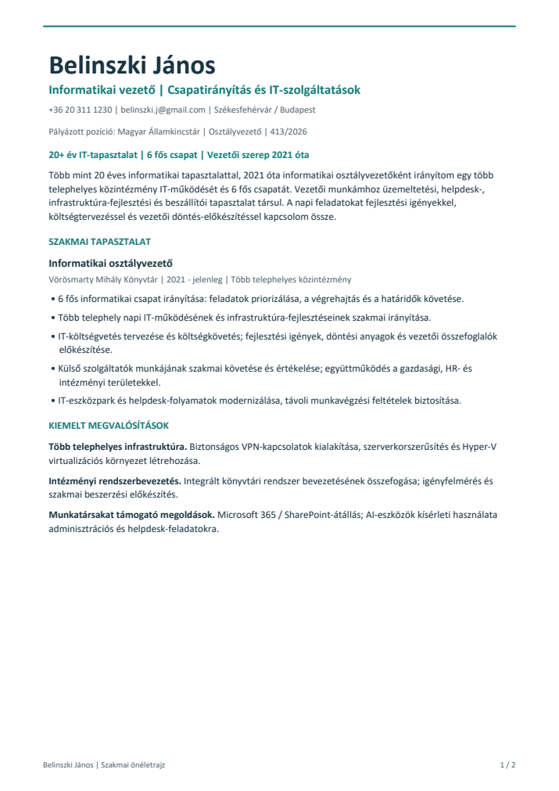
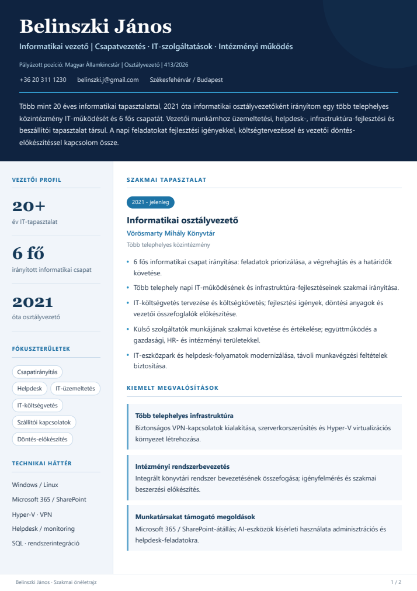

# Mindhárom önéletrajz-változat

A **v19, v20 és v21** külön fájlokban megmaradt, mindkét álláshoz. A képre kattintva az adott PDF nyílik meg. Az előnézet az első oldalt mutatja; minden PDF kétoldalas.

## Nova HR - IT igazgató

| v19 - egyszerű, egyhasábos | v20 - oldalsávos | v21 - újraszerkesztett |
|---|---|---|
|  |  |  |
| **[v19 PDF](../../output/pdf/Belinszki_Janos_CV_Nova_IT_igazgato_v19.pdf)** · [HTML](Belinszki_Janos_CV_Nova_IT_igazgato_v19.html) | **[v20 PDF](../../output/pdf/Belinszki_Janos_CV_Nova_IT_igazgato_v20.pdf)** · [HTML](Belinszki_Janos_CV_Nova_IT_igazgato_v20.html) | **[v21 PDF](../../output/pdf/Belinszki_Janos_CV_Nova_IT_igazgato_v21.pdf)** · [HTML](Belinszki_Janos_CV_Nova_IT_igazgato_v21.html) |

## Magyar Államkincstár - Osztályvezető, 413/2026

| v19 - egyszerű, egyhasábos | v20 - oldalsávos | v21 - újraszerkesztett |
|---|---|---|
|  |  |  |
| **[v19 PDF](../../output/pdf/Belinszki_Janos_CV_MAK_Osztalyvezeto_413_2026_v19.pdf)** · [HTML](Belinszki_Janos_CV_MAK_Osztalyvezeto_413_2026_v19.html) | **[v20 PDF](../../output/pdf/Belinszki_Janos_CV_MAK_Osztalyvezeto_413_2026_v20.pdf)** · [HTML](Belinszki_Janos_CV_MAK_Osztalyvezeto_413_2026_v20.html) | **[v21 PDF](../../output/pdf/Belinszki_Janos_CV_MAK_Osztalyvezeto_413_2026_v21.pdf)** · [HTML](Belinszki_Janos_CV_MAK_Osztalyvezeto_413_2026_v21.html) |

GitHubon a PDF-ek és képek megjelennek. A HTML-link a szerkeszthető forrásfájlt mutatja; letöltés után böngészőben is megnyitható.

[Az eredeti v18 HTML](../../profile/sources/originals/CV_Belinszki_Janos_OBH_v18.html) is megmaradt. [v21: mindkét oldal és szerkesztési indoklás](CV_V21.md) · [Álláshirdetések és jelentkezési tudnivalók](README.md).
