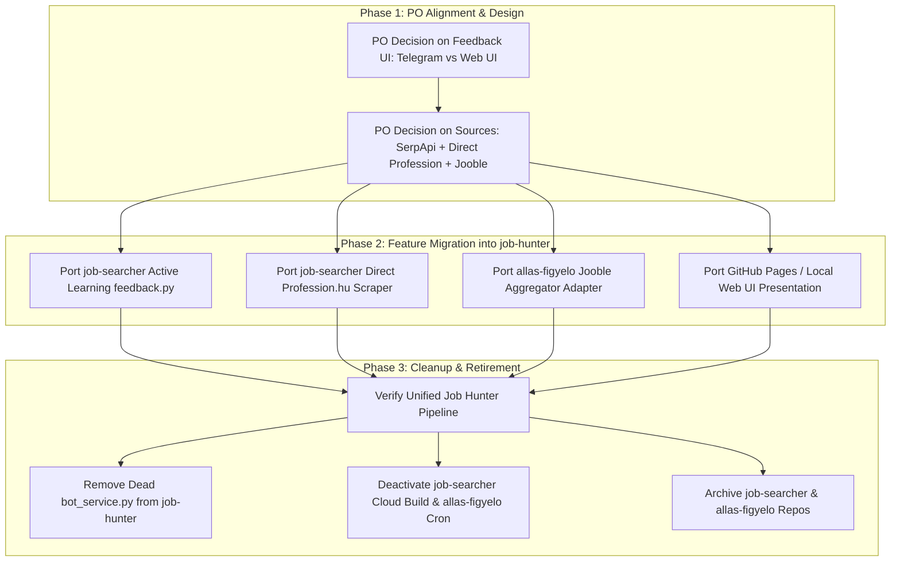

# Job Hunter — One-Repo Consolidation Audit & Planning (Gemini, Independent)

**Task:** `JOB-HUNTER-CONSOLIDATION-001` (Track B of `JOB-HUNTER-PO-CLARIFICATION-AND-CONSOLIDATION-001`)  
**Role:** Gemini 3.6 Flash (Independent AI Research & System Audit Role)  
**Date:** 2026-09-04  
**Scope:** Analysis and migration planning only. **Zero code moves, zero merges, zero file deletions, zero service/scheduler disables, and zero repository retirements were performed.**  
**Canonical Destination Repository:** `ggiaur/job-hunter` (Confirmed target).  
**Repositories Inspected:**
- `job-hunter` (local checkout `/srv/projects/job-hunter`)
- `job-searcher` (local checkout `/srv/projects/job-searcher`)
- `allas-figyelo` (cloned checkout `git@github.com:ggiaur/allas-figyelo.git`)
- `cv-linkedin` (remote checked via `git ls-remote git@github.com:ggiaur/cv-linkedin.git` — confirmed 0 refs/empty)

---

## 1. Executive Summary & Core Findings

1. **Lineage & Dead Code Verification:**  
   `job-hunter` was originally bootstrapped from `job-searcher`. The files `bot_service.py` and `Dockerfile.bot` in `job-hunter` are **byte-identical** to those in `job-searcher` (`diff` exit code 0). However, `job-hunter`'s active operational pipeline (`apps/job-hunter-mvp/run.mjs` under JH-SUP-0022/0023) does **not** import or execute `bot_service.py`. Therefore, the bot-service files inside `job-hunter` represent **dead code** relative to the live production pipeline.

2. **Complementary Assets Identified:**  
   `job-searcher` and `allas-figyelo` contain valuable capabilities that directly solve gaps identified in Track A's business model review:
   - **Feedback & Learning (`job-searcher`):** Working 1-click feedback capture (`tools/feedback.py`) and active-learning rule auto-promotion (2x DISLIKE → `exclusions.yaml`, 2x LIKE → `preferred_companies.yaml`).
   - **Direct Source Ingestion (`job-searcher`):** Direct Profession.hu scraper via Firecrawl (`tools/scraper.py`), bypassing search engine indexing latency.
   - **Geographic & Aggregator Expansion (`allas-figyelo`):** Jooble API adapter (`fetch_jobs.py`) covering the PO's home region (Székesfehérvár, Győr, Veszprém, Tata, Tatabánya, Várpalota).
   - **Web Presentation (`allas-figyelo`):** Lightweight static web UI output generator (`docs/jobs.json` + GitHub Pages pattern).

3. **No Immediate Retirement:**  
   No running services or repository retirements should occur until candidate features are ported to `job-hunter` and validated under real operational runs.

---

## 2. Code Lineage & File Comparison Details

| File Pair | `job-hunter` vs `job-searcher` | Status in `job-hunter` | Analysis |
|---|---|---|---|
| `bot_service.py` | Byte-identical (137 lines) | Dead code | Carried over during repo fork; not referenced by `apps/job-hunter-mvp/run.mjs` or `schedule/run-job-hunter-mvp.sh`. |
| `Dockerfile.bot` | Byte-identical (720 bytes) | Dead code | Unused in `job-hunter` active MVP container footprint. |
| `cloudbuild-bot.yaml` | String diff (`job-hunter-503608` vs `job-searcher-503608`) | Inactive config | Referencing separate GCP Artifact Registry repos. |
| `profile/persona.md` | ~90% content overlap | Active baseline | `job-hunter` copy is more evolved (stricter language floor, updated IT leadership focus). |
| `profile/learned_preferences.md` | Diverged | Active baseline | `job-searcher` contains template placeholders; `job-hunter` has real feedback history from JH-SUP runs. |

---

## 3. Migration & Retirement Readiness Matrix

| Asset Description | Origin Repository | Classification | Evidence & Test State | Strategic Value for `job-hunter` |
|---|---|---|---|---|
| **Bot-Service Files** (`bot_service.py`, `Dockerfile.bot`, `cloudbuild-bot.yaml`) | `job-hunter` & `job-searcher` | `OBSOLETE_OR_DUPLICATED` in `job-hunter` | Byte-identical `diff`; completely detached from `run.mjs` pipeline. | Candidate for deletion in `job-hunter` clean-up pass once PO approves architecture. |
| **Active Learning & Preference Promotion** (`tools/feedback.py`, `profile/`) | `job-searcher` | `KEEP_AND_MIGRATE (Candidate)` | `DONE.md` §3; 35/35 passing unit tests. Auto-promotes 2x DISLIKE → `exclusions.yaml` (0 pt) & 2x LIKE → `preferred_companies.yaml` (+10 pt). | Directly implements the "learn from feedback" gap flagged in Track A review. High priority for migration. |
| **Telegram Card & 1-Click Feedback Flow** (`tools/notifier.py`, `tools/feedback.py`) | `job-searcher` | `KEEP_AND_MIGRATE (Candidate)` | Telegram inline keyboard buttons sending callbacks to `feedback.py`. | Provides instant PO feedback delivery channel if Telegram is preferred over local Web UI. |
| **Direct Profession.hu Scraper** (`tools/scraper.py`) | `job-searcher` | `KEEP_AND_MIGRATE (Candidate)` | `DECISIONS.md` §3; validated 20 real job ads directly from Profession.hu search URL. | Solves PO's requirement for direct source ingestion bypassing SerpApi indexing lag. |
| **Circuit Breaker & Rate Limiter** (`agents/job_search_agent.py`) | `job-searcher` | `KEEP_AS_REFERENCE_HISTORY` | 10s scraping timeout, 3-strike circuit breaker, 10 req/min Gemini backoff. | Reference pattern for scraping resilience when direct scraping is integrated. |
| **Unit Test Suite** (35 tests, `tests/`) | `job-searcher` | `KEEP_AS_REFERENCE_HISTORY` | 35 passed in 100s. Includes regression tests for Firecrawl & GenAI SDK imports (`DECISIONS.md` §4). | Reference template for establishing Python unit test suite in `job-hunter`. |
| **Firestore Run Logging** (`tools/storage.py`) | `job-searcher` | `PO_DECISION_REQUIRED` | Persists run execution status (`running`/`completed`) and counts to GCP Firestore. | External GCP dependency. Useful if cloud persistence is desired, otherwise local JSON logs suffice. |
| **Jooble Aggregator Adapter** (`fetch_jobs.py`) | `allas-figyelo` | `KEEP_AND_MIGRATE (Candidate)` | Queries Jooble API for IT leadership roles across 7 home-region cities (Székesfehérvár, Győr, etc., radius 26km). | Expands ingestion coverage to non-Google job aggregator and home region outside Budapest. |
| **GitHub Pages Web UI** (`docs/jobs.json` + static presentation) | `allas-figyelo` | `KEEP_AND_MIGRATE (Candidate)` | Zero-cost static web UI reading structured `jobs.json`. | Lightweight interim web presentation layer for `job-hunter` results before building full web app. |
| **Email Digest Digest** (`fetch_jobs.py` SMTP Gmail) | `allas-figyelo` | `KEEP_AS_REFERENCE_HISTORY` | Sends HTML/text email digest of new listings via Gmail App Password. | Optional secondary notification delivery mechanism. |
| **`cv-linkedin` Repo** | GitHub remote `git@github.com:ggiaur/cv-linkedin.git` | `OBSOLETE_OR_EMPTY` | `git ls-remote` returns 0 refs (empty repo). | No code or data to migrate. Safe to ignore or delete remote repo. |

---

## 4. External Secrets & Runtime Dependencies Audit

1. **`job-searcher` Runtime Dependencies:**
   - **Secrets required:** GCP Cloud Build trigger permissions, Firestore DB credentials, Telegram Bot Token & Chat ID, Gemini API Key, Firecrawl API Key.
   - **Secret Storage:** Managed via `.env` files locally or GCP Secret Manager.
   - **Migration Impact:** Standardize into `job-hunter`'s existing secret pattern `/home/dockeruser/.job-hunter-secrets/`.

2. **`allas-figyelo` Runtime Dependencies:**
   - **Secrets required:** `JOOBLE_API_KEY`, `GMAIL_USER`, `GMAIL_APP_PASSWORD`, `RECIPIENT_EMAIL`.
   - **Secret Storage:** Configured as GitHub Actions Repository Secrets.
   - **Migration Impact:** Extract API keys to local `job-hunter` secret files if migrating Jooble ingestion.

3. **`job-hunter` Active Runtime:**
   - **Secrets required:** SerpApi Key, Gemini API Key.
   - **Secret Storage:** `/home/dockeruser/.job-hunter-secrets/` and local systemd environment variables.

---

## 5. Recommended Phased Consolidation Roadmap

### Next Actionable Steps for Product Owner:
1. **Approve Target Channel:** Decide whether PO feedback should be captured via Telegram buttons (from `job-searcher`) or a local/GitHub Pages Web UI (from `allas-figyelo`/Track A draft).
2. **Approve Ingestion Plugins:** Confirm enabling direct Profession.hu scraping (`job-searcher`) and Jooble home-region queries (`allas-figyelo`) alongside SerpApi in `job-hunter`.
3. **Authorize Migration Sprint:** Authorize Sprint execution to port the selected candidate modules into `job-hunter` before retiring legacy repositories.
