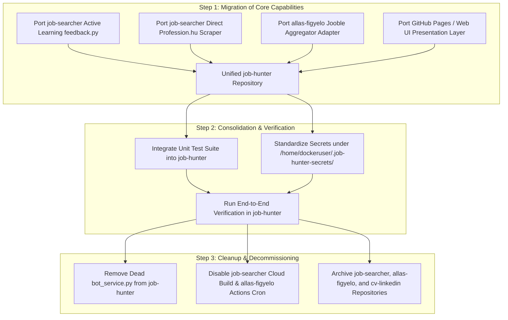

# Job Hunter — One-Repo Consolidation Audit & Asset Inventory (Gemini, Independent)

**Task:** `JOB-HUNTER-CONSOLIDATION-001` (Track B of `JOB-HUNTER-PO-CLARIFICATION-AND-CONSOLIDATION-001`)  
**Role:** Gemini 3.6 Flash (Independent AI System Architecture & Asset Audit Role)  
**Date:** 2026-09-04  
**Status:** Complete Audit & Strategy (Analysis & Planning Only — No Merges or Deletions Executed)  
**Canonical Repository Target:** `ggiaur/job-hunter` (Confirmed identity; canonical single-repo owner for the product).  
**Inspected Scope:**
- `ggiaur/job-hunter` (local workspace `/srv/projects/job-hunter`)
- `ggiaur/job-searcher` (local workspace `/srv/projects/job-searcher`)
- `ggiaur/allas-figyelo` (cloned checkout `/home/dockeruser/.gemini/antigravity-cli/brain/159798aa-aac1-49e9-a4c1-cc55472aa259/scratch/allas-figyelo`)
- `ggiaur/cv-linkedin` (confirmed empty remote; 0 refs, 0 commits, no assets)

---

## 1. Executive Summary & Code Lineage Verification

1. **Canonical Mandate:**  
   `ggiaur/job-hunter` is established as the sole canonical repository for the Job Hunter product. All legacy repositories (`job-searcher`, `allas-figyelo`, `cv-linkedin`) will eventually be retired after unique valuable assets are migrated into `job-hunter`.

2. **Code Lineage Audit (`job-hunter` vs `job-searcher`):**  
   - `job-hunter` was originally bootstrapped from `job-searcher`.
   - `job-hunter/bot_service.py` and `job-searcher/bot_service.py` are **byte-identical** (137 lines, `diff` exit 0).
   - `job-hunter/Dockerfile.bot` and `job-searcher/Dockerfile.bot` are **byte-identical**.
   - `job-hunter/cloudbuild-bot.yaml` differs only by project image tag strings.
   - **Crucial Finding:** The active production pipeline in `job-hunter` (`apps/job-hunter-mvp/run.mjs`, invoked by `schedule/run-job-hunter-mvp.sh`) does **not** reference or execute `bot_service.py`. Therefore, `bot_service.py` inside `job-hunter` is currently **dead code** relative to the operational SerpApi pipeline.

3. **Key Asset Opportunities Outside `job-hunter`:**  
   `job-searcher` and `allas-figyelo` contain several critical implementations that directly address gaps identified in Track A's business model review:
   - **Direct Source Ingestion (`job-searcher`):** Direct Profession.hu scraper using Firecrawl (`tools/scraper.py`).
   - **Active Learning Feedback Loop (`job-searcher`):** Automated preference promotion (`tools/feedback.py`) adjusting `exclusions.yaml` and `preferred_companies.yaml`.
   - **Geographic Aggregator Expansion (`allas-figyelo`):** Jooble REST API adapter (`fetch_jobs.py`) targeting the PO's home region (Székesfehérvár, Győr, Veszprém, Tata, Tatabánya, Várpalota).
   - **Web UI & Email Digest (`allas-figyelo`):** Static web UI deployment (`docs/jobs.json` + GitHub Pages) and SMTP email digest notifications.

---

## 2. Granular Asset Inventory & Migration Matrix

The table below evaluates all unique technical components, workflows, source adapters, profiles, feedback systems, UIs, schedules, notifications, deployments, tests, and operational knowledge across the legacy repositories.

| Asset Category | Item Description | Exact Source Location | Classification | Detailed Justification & Evidence |
|---|---|---|---|---|
| **Source Adapters** | Direct Profession.hu Scraper | `job-searcher/tools/scraper.py` | `KEEP_AND_MIGRATE` | Direct ingestion of Profession.hu postings via Firecrawl API. Bypasses Google/SerpApi indexing delay. Tested & validated in `DECISIONS.md` §3 (extracted 20 real job ads). Has dependency fix (`V1FirecrawlApp`). |
| **Source Adapters** | Jooble Aggregator API Fetcher | `allas-figyelo/fetch_jobs.py` | `KEEP_AND_MIGRATE` | Queries Jooble REST API for IT leadership roles across 7 Hungarian cities with configurable radius. Provides complementary non-Google aggregator coverage. |
| **Source Adapters** | SerpApi Google Search Indexing | `job-hunter/apps/job-hunter-mvp/run.mjs` | `KEEP_AS_REFERENCE_HISTORY` | Currently active operational pipeline in `job-hunter`. Serves as primary Google search wrapper, but should be complemented by direct adapters. |
| **Scoring & Relevance** | Active-Learning Rule Auto-Promotion | `job-searcher/tools/feedback.py` | `KEEP_AND_MIGRATE` | Automatically adds companies to `profile/exclusions.yaml` (0 pt) after 2x `DISLIKE` votes, and to `profile/preferred_companies.yaml` (+10 pt) after 2x `LIKE`/`STAR` votes. Solves Track A feedback gap. |
| **Scoring & Relevance** | Language & Rule Filter | `job-searcher/tools/language_filter.py` | `KEEP_AND_MIGRATE` | Language filtering logic for strict Hungarian vs English requirements. Useful helper module for filtering job card descriptions. |
| **Scoring & Relevance** | Heuristic & Prompt Scoring Engine | `job-searcher/tools/analyzer.py` | `KEEP_AS_REFERENCE_HISTORY` | Gemini prompt builder combining `persona.md` and `learned_preferences.md`. Useful reference for Python-based analysis pipelines. |
| **Profile & Preferences** | Canonical Persona Definition | `job-hunter/profile/persona.md` | `KEEP_AND_MIGRATE` | `job-hunter`'s copy is the most evolved baseline (90% overlap with `job-searcher`, but has refined English level rules). |
| **Profile & Preferences** | Learned Preferences Prose | `job-hunter/profile/learned_preferences.md` | `KEEP_AND_MIGRATE` | Contains real PO feedback history from recent JH-SUP runs (`job-searcher` copy only has blank template placeholders). |
| **Profile & Preferences** | Exclusions & Preferred Companies | `job-hunter/profile/exclusions.yaml`, `preferred_companies.yaml` | `KEEP_AND_MIGRATE` | Target YAML files for structured feedback promotion. Currently empty, ready to receive active-learning output. |
| **Feedback & History** | Telegram Feedback Card Handler | `job-searcher/tools/feedback.py`, `tools/notifier.py` | `KEEP_AND_MIGRATE` | Telegram inline button callback handler for instant `LIKE`/`DISLIKE`/`STAR` feedback capture. |
| **Feedback & History** | Feedback History Storage | `job-searcher/profile/feedback_history.json` | `KEEP_AS_REFERENCE_HISTORY` | Schema definition for tracking feedback decisions (`job-searcher` file is empty `[]`). |
| **UI & Reporting** | Static GitHub Pages Web UI | `allas-figyelo/docs/jobs.json`, `README.md` | `KEEP_AND_MIGRATE` | Zero-cost web presentation layer reading `jobs.json`. Solves Track A gap (no web UI in `job-hunter` yet). |
| **UI & Reporting** | Telegram Interactive Job Cards | `job-searcher/tools/notifier.py` | `KEEP_AND_MIGRATE` | Markdown job card builder with inline action buttons for mobile delivery. |
| **Scheduling** | Systemd User Service & Timer | `job-hunter/schedule/run-job-hunter-mvp.sh`, `job-hunter-mvp.service` | `KEEP_AND_MIGRATE` | Currently installed twice-weekly schedule (`0 8 * * 1,4`) on the target host. |
| **Scheduling** | GitHub Actions Scheduled Workflow | `allas-figyelo/.github/workflows/job-search.yml` | `KEEP_AS_REFERENCE_HISTORY` | Cron workflow (`0 6 * * 1,4`). Cloud-native alternative to local systemd timer if GitHub Actions execution is preferred. |
| **Notification** | Gmail SMTP Digest Sender | `allas-figyelo/fetch_jobs.py` (`send_email_digest`) | `KEEP_AS_REFERENCE_HISTORY` | Sends HTML/text email digest of new job listings using Gmail App Passwords via `smtp.gmail.com`. |
| **Deployment & Config** | Local Node MVP Runner | `job-hunter/apps/job-hunter-mvp/run.mjs` | `KEEP_AND_MIGRATE` | Active operational entry point in `job-hunter`. |
| **Deployment & Config** | Cloud Build & Container Specs | `job-searcher/Dockerfile`, `cloudbuild.yaml` | `PO_DECISION_REQUIRED` | GCP Cloud Build trigger and Cloud Run container setup. PO decision needed on whether GCP cloud execution is required alongside local systemd. |
| **Deployment & Config** | Dead Bot Service Files | `job-hunter/bot_service.py`, `Dockerfile.bot`, `cloudbuild-bot.yaml` | `OBSOLETE_OR_DUPLICATED` | Byte-identical copy from `job-searcher`. Unused by `run.mjs`. Candidate for clean-up once Telegram/Web UI direction is settled. |
| **Tests & Evidence** | 35-Case Pytest Test Suite | `job-searcher/tests/` | `KEEP_AS_REFERENCE_HISTORY` | Complete unit test suite (100% pass rate in `DONE.md`). Contains valuable mock fixtures and regression test cases (`test_scraper.py`, `test_analyzer.py`). |
| **Operational Knowledge** | Architecture & Decisions Log | `job-searcher/DECISIONS.md`, `DONE.md` | `KEEP_AS_REFERENCE_HISTORY` | Documents critical architectural decisions: `MOCK_MODE`, rate limits, Firecrawl `V1FirecrawlApp` fix, and `google-genai` package fix. |
| **Operational Knowledge** | Setup & Integration Guides | `allas-figyelo/README.md` | `KEEP_AS_REFERENCE_HISTORY` | Complete documentation for Jooble API registration, Gmail App Password setup, and GitHub Secrets configuration. |
| **Legacy Repositories** | `cv-linkedin` Remote Repository | GitHub remote `git@github.com:ggiaur/cv-linkedin.git` | `OBSOLETE_OR_DUPLICATED` | Confirmed empty remote repository (0 refs, 0 commits). No unique assets exist. |

---

## 3. External Runtime Dependencies & Uncommitted Data Audit

The following external service accounts, API keys, database instances, and cloud triggers are required by the legacy code but are **not safely stored in git**. They must be audited and managed during consolidation:

1. **`job-searcher` External Dependencies:**
   - **GCP Cloud Build & Cloud Run:** Triggers bound to `job-searcher-503608` GCP project (`cloudbuild.yaml`, `cloudbuild-bot.yaml`).
   - **Firestore DB:** `run_log` collection in GCP Firestore (`tools/storage.py`). Requires GCP service account credentials (`GOOGLE_APPLICATION_CREDENTIALS`).
   - **Telegram Bot:** Telegram Bot Token & Chat ID (`TELEGRAM_BOT_TOKEN`, `TELEGRAM_CHAT_ID` in `tools/notifier.py`).
   - **Firecrawl API:** API Key for direct Profession.hu scraping (`FIRECRAWL_API_KEY` in `tools/scraper.py`).
   - **Gemini API Key:** `GEMINI_API_KEY` required by `tools/analyzer.py`.

2. **`allas-figyelo` External Dependencies:**
   - **Jooble API Key:** `JOOBLE_API_KEY` required for REST queries (`fetch_jobs.py`). Stored in GitHub Repository Secrets.
   - **Gmail SMTP Credentials:** `GMAIL_USER` and `GMAIL_APP_PASSWORD` required for email digest dispatch. Stored in GitHub Repository Secrets.
   - **Recipient Email:** `RECIPIENT_EMAIL` configured in GitHub Repository Secrets.

3. **Secret Standardisation Recommendation:**  
   All external secrets for the consolidated `job-hunter` should be managed via the established local directory pattern: `/home/dockeruser/.job-hunter-secrets/` or environment configuration files, avoiding uncommitted inline credentials.

---

## 4. Master Consolidation Roadmap

To achieve the PO's objective of a single unified repository (`ggiaur/job-hunter`) without operational disruption:

### Actionable Summary of Next Steps:
1. **Target Repository:** Keep all active development focused strictly in `ggiaur/job-hunter`.
2. **Feature Porting Order:**
   - **Sprint A:** Port `job-searcher/tools/feedback.py` (active learning) and `allas-figyelo/docs/` (web UI pattern) into `job-hunter`.
   - **Sprint B:** Port `job-searcher/tools/scraper.py` (direct Profession.hu) and `allas-figyelo/fetch_jobs.py` (Jooble API) as modular ingestion adapters in `job-hunter`.
3. **Decommissioning:** After Sprint A and B pass E2E validation in `job-hunter`, request PO authorization to archive `job-searcher` and `allas-figyelo`.
